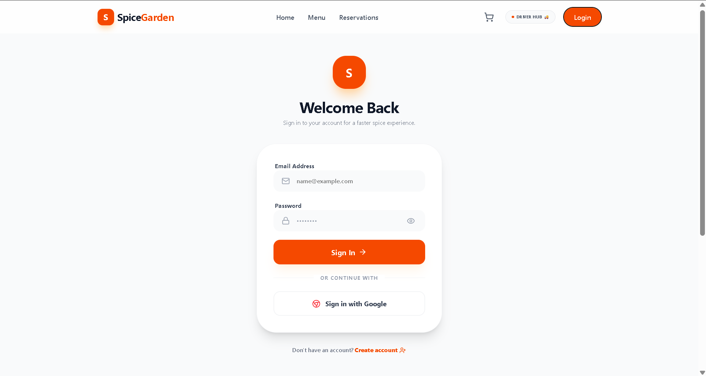
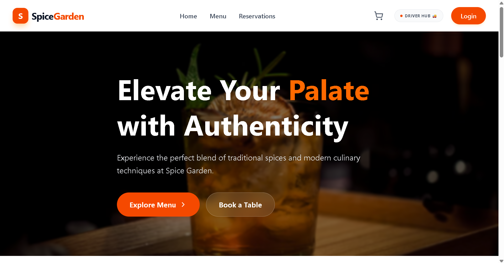
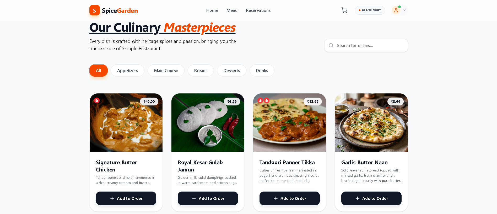
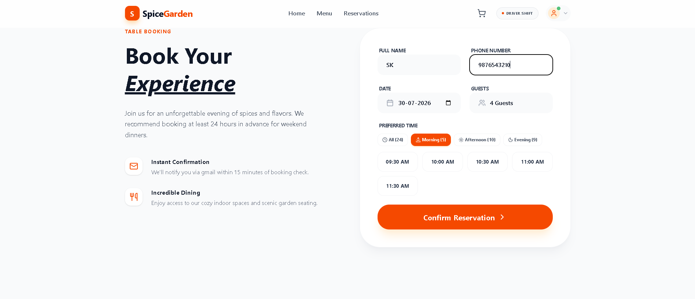
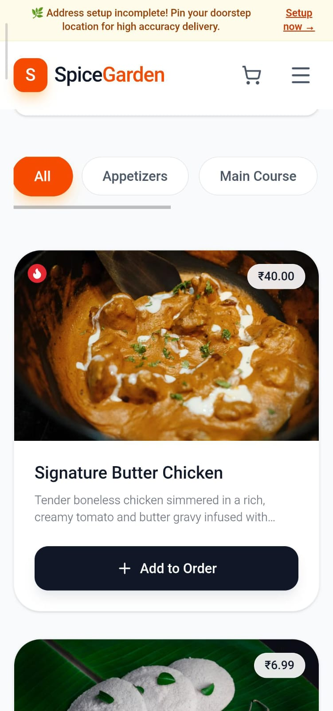
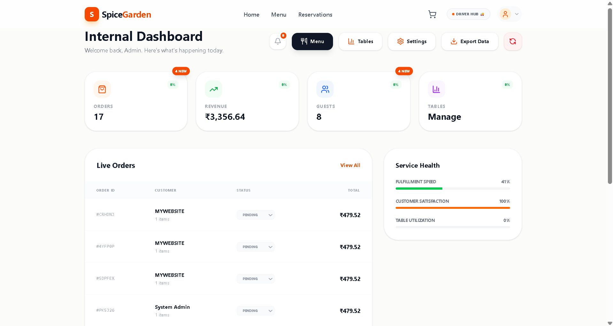

# 🍽️ Restaurant Website

A modern and responsive restaurant website designed to provide a clean, engaging, and user-friendly experience across desktop and mobile devices.

## 🔗 Live Demo

👉 [View the Live Website](https://sample-website-demo.web.app)

## 📌 Project Overview

This project focuses on creating a professional restaurant website with a clean layout, smooth navigation, responsive design, and an engaging user experience.

The website can be customized based on different restaurant and business requirements.

## ✨ Key Highlights

- Modern and clean user interface
- Responsive design for desktop and mobile devices
- Smooth navigation between website sections
- Well-structured website layout
- User-friendly browsing experience
- Easy customization for different business requirements

## 📸 Screenshots

### 🏠 Login Page

### 🏠 Home Page

### ✨ Menu Page 

### ✨ Reservation Page 

### 📱 Mobile View

### ✨ Admin Dashboard

## 🛠️ Development Approach

This project was developed using a modern, AI-assisted development workflow. The tools and technologies were selected based on the project requirements.

The repository contains a stable project version prepared for portfolio and demonstration purposes.

## 🔐 Security Note

Sensitive credentials, API keys, private configuration details, and production secrets are not included in this repository.

## 📄 Disclaimer

This repository contains a demo/template version created for portfolio purposes. Client-specific branding, business data, credentials, and production configurations are managed separately and are not included in this public repository.

## 📌 Version

**v1.0 – Initial Layout**
